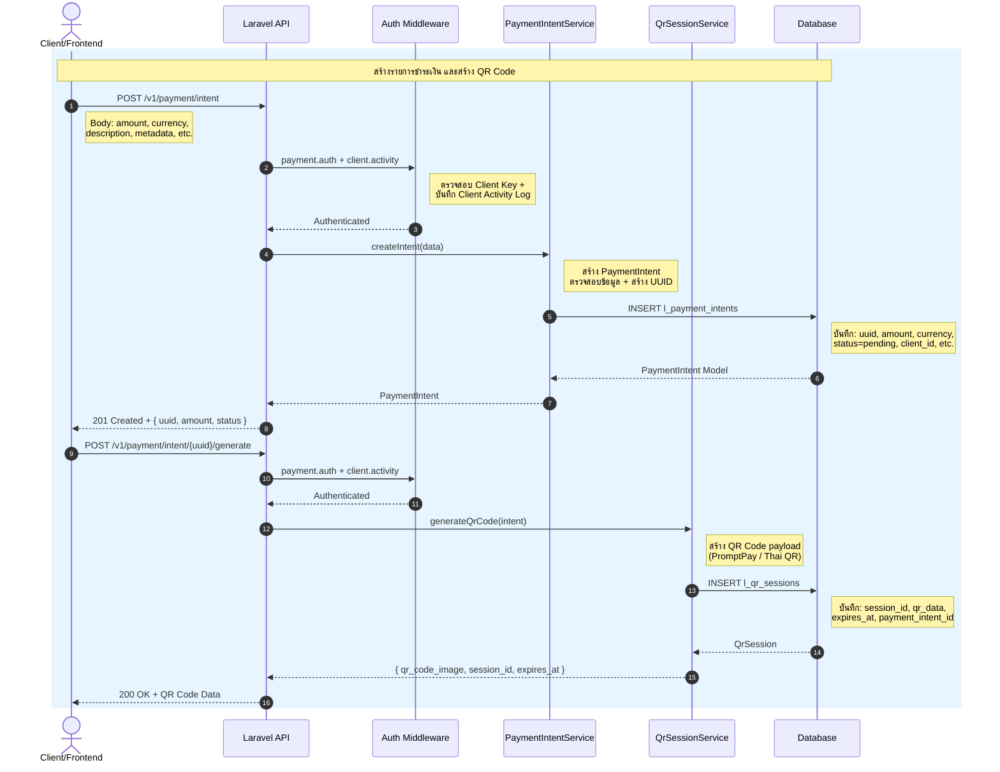
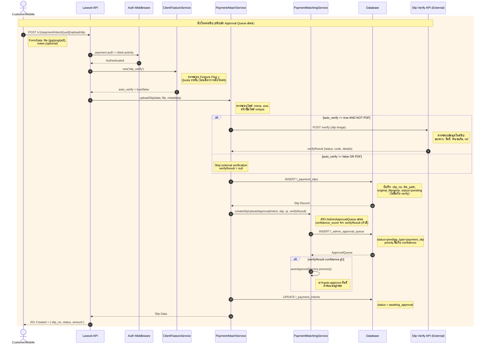
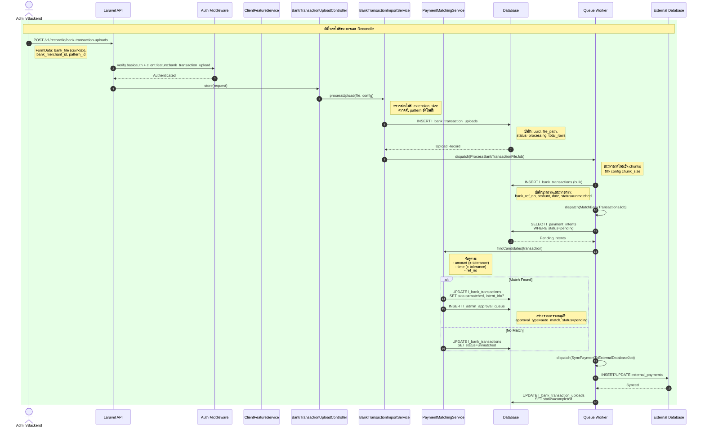
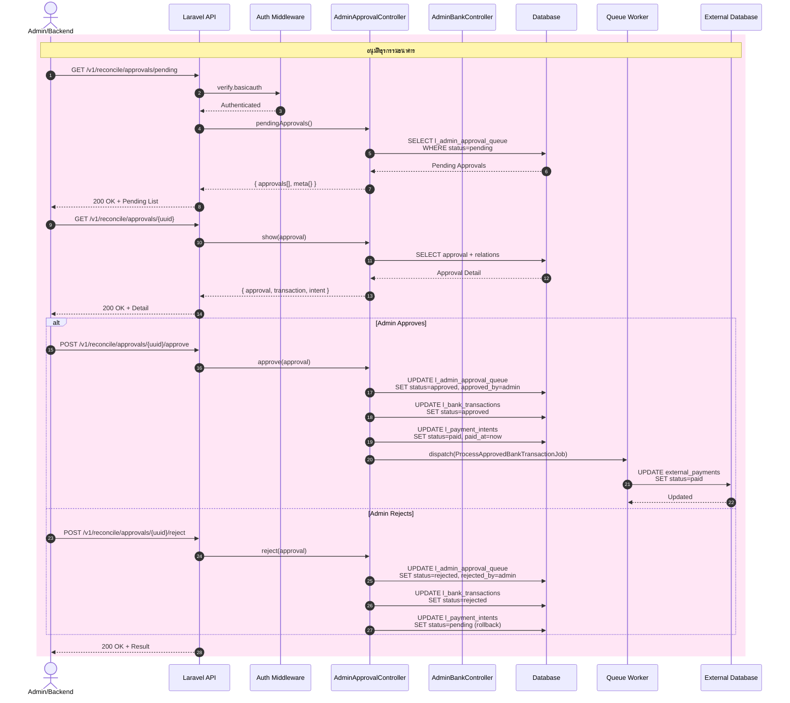
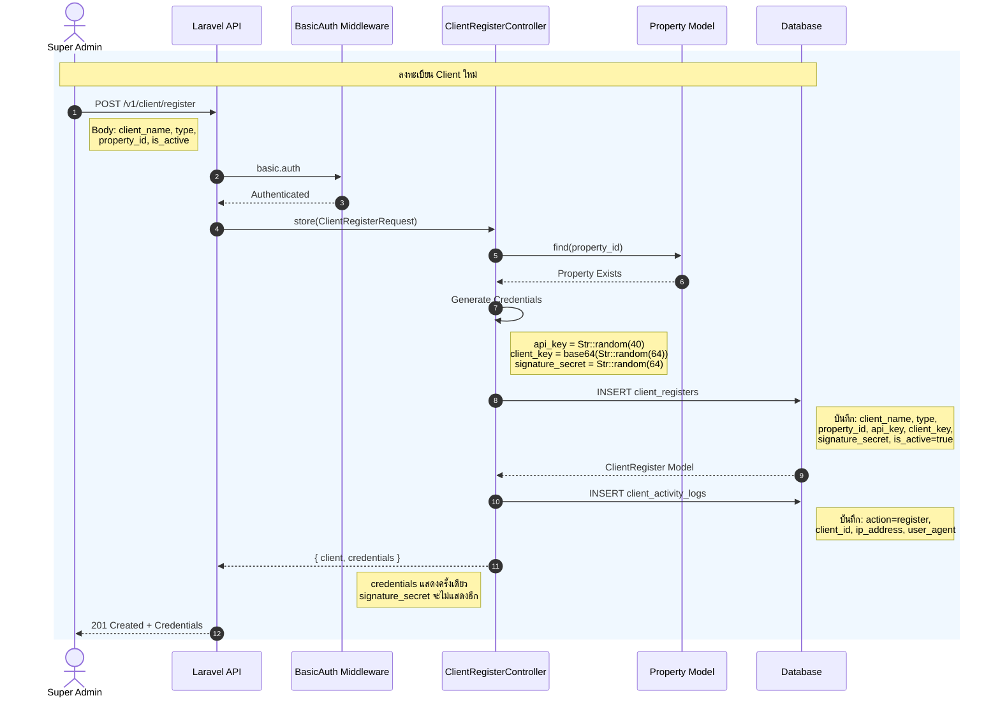
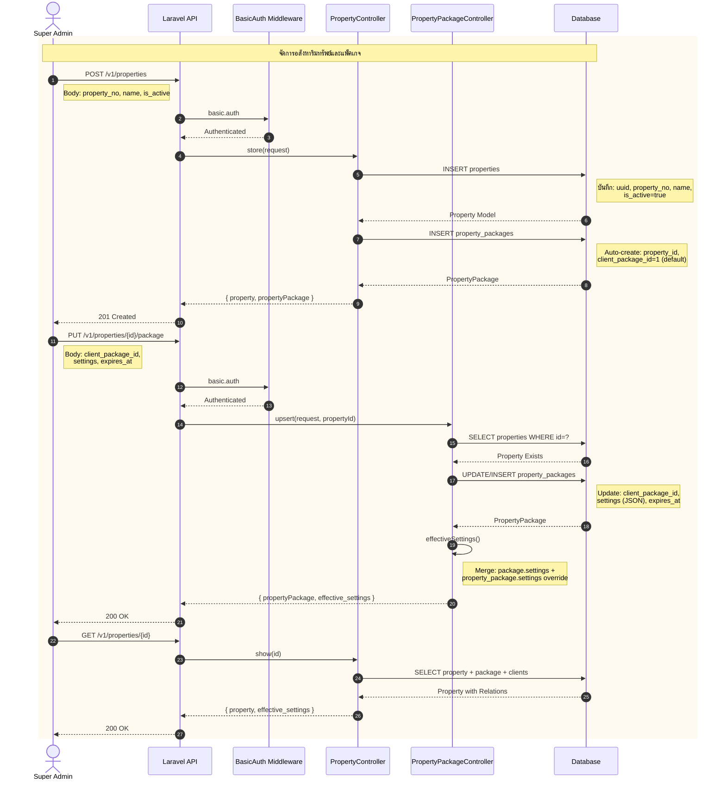
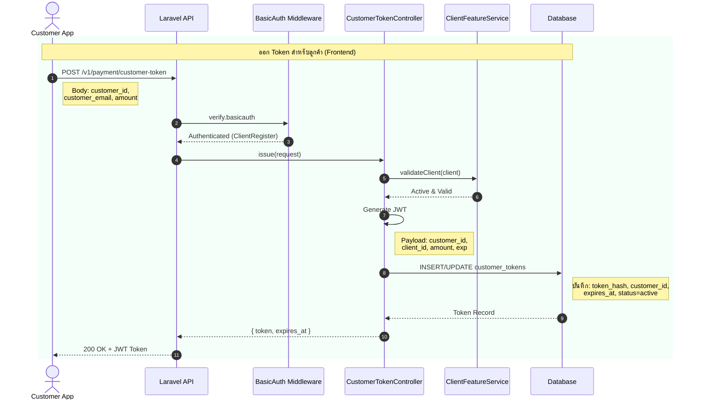

# Sequence Diagrams — App Payments

> เอกสารนี้รวม Sequence Diagram หลัก ๆ ของระบบ `app_payments` เพื่อให้เห็นภาพ flow การทำงานของแต่ละส่วน

---

## 📋 สารบัญ

1. [Flow 1: Payment Intent & QR Code Generation](#flow-1-payment-intent--qr-code-generation)
2. [Flow 2: Slip Upload & Verification](#flow-2-slip-upload--verification)
3. [Flow 3: Bank Transaction Reconciliation](#flow-3-bank-transaction-reconciliation)
4. [Flow 4: Admin Approval Queue](#flow-4-admin-approval-queue)
5. [Flow 5: Client Registration](#flow-5-client-registration)
6. [Flow 6: Property Management](#flow-6-property-management)
7. [Flow 7: Customer Token Issuance](#flow-7-customer-token-issuance)

---

## Flow 1: Payment Intent & QR Code Generation



### รายละเอียดเพิ่มเติม

| ขั้นตอน | รายละเอียด                                                                    |
| ------- | ----------------------------------------------------------------------------- |
| 1       | Client ส่งคำขอสร้าง Payment Intent พร้อมข้อมูลการชำระเงิน                     |
| 2       | Middleware `payment.auth` ตรวจสอบ Client Key และ `client.activity` บันทึก log |
| 3       | `PaymentIntentService::createIntent()` ตรวจสอบข้อมูลและสร้าง UUID             |
| 4       | บันทึกลงตาราง `l_payment_intents` สถานะเริ่มต้นเป็น `pending`                 |
| 5       | ส่งคืน Payment Intent UUID ให้ Client                                         |
| 6       | Client ขอสร้าง QR Code จาก Payment Intent UUID                                |
| 7       | `QrSessionService::generateQrCode()` สร้าง QR payload ตามมาตรฐาน PromptPay    |
| 8       | บันทึก QR Session ลง `l_qr_sessions` พร้อมกำหนดเวลาหมดอายุ                    |
| 9       | ส่ง QR Code (base64 image) กลับให้ Client แสดงผล                              |

---

## Flow 2: Slip Upload & Verification



### รายละเอียดเพิ่มเติม

| ขั้นตอน | รายละเอียด                                                                                                                                                     |
| ------- | -------------------------------------------------------------------------------------------------------------------------------------------------------------- |
| 1       | Customer อัปโหลดสลิปการโอนเงิน (รองรับ jpg, jpeg, png, pdf)                                                                                                    |
| 2       | ตรวจสอบสิทธิ์ Client และบันทึก Activity Log                                                                                                                    |
| 3       | `ClientFeatureService::can('slip_verify')` ตรวจสอบว่าลูกค้าเปิดใช้งานฟีเจอร์นี้และยังมี quota เหลือหรือไม่ — **ไม่บล็อกการอัปโหลด** แค่ส่งค่า `auto_verify` ไป |
| 4       | `PaymentAttachService::uploadSlip()` ตรวจสอบไฟล์และสร้างชื่อ unique                                                                                            |
| 5       | **ถ้า `auto_verify=true` และไม่ใช่ PDF** → เรียก External Slip Verify API (non-blocking, ถ้าล้มเหลว upload ยังดำเนินต่อ)                                       |
| 6       | **บันทึกสลิปลง `l_payment_slips`** สถานะ `pending` — **เกิดขึ้นเสมอ**                                                                                          |
| 7       | **สร้าง `AdminApprovalQueue`** สถานะ `pending` — **เกิดขึ้นเสมอ** โดย `confidence_score` และ `priority` จะสูงขึ้นถ้ามี verifyResult                            |
| 8       | **ถ้า confidence สูงพอ** → `autoApprovalService` อาจอนุมัติอัตโนมัติทันที                                                                                      |
| 9       | อัปเดต Payment Intent เป็น `awaiting_approval`                                                                                                                 |

### สรุป Logic `slip_verify`

```
┌─────────────────────────────────────────────────────────────┐
│  อัปโหลดสลิป ──► สร้าง Slip Record ──► สร้าง Approval Queue   │
│       ▲              (เสมอ)              (เสมอ)             │
│       │                                                     │
│  slip_verify feature?                                       │
│       │                                                     │
│       ├── YES ──► เรียก SlipVerifyService (ภายนอก)         │
│       │              │                                      │
│       │              └──► เพิ่ม confidence_score          │
│       │                   เพิ่ม priority                    │
│       │                   อาจ trigger auto-approval           │
│       │                                                     │
│       └── NO ──► verifyResult = null                        │
│                     confidence_score = 0 (default)            │
│                     priority = ปกติ                         │
│                     รอ Admin อนุมัติตามปกติ                 │
└─────────────────────────────────────────────────────────────┘
```

**หลักการสำคัญ:** `slip_verify` เป็น **optional enhancement** ที่ช่วยเพิ่มความน่าเชื่อถือของสลิป แต่ไม่ว่าจะ verify หรือไม่ สลิปก็จะถูกสร้างและส่งเข้า `admin_approval_queue` เสมอ — ต่างกันแค่ **ความเร็วในการได้รับการอนุมัติ** (auto-approve vs รอ manual approve)

---

## Flow 3: Bank Transaction Reconciliation



### รายละเอียดเพิ่มเติม

| ขั้นตอน | รายละเอียด                                                                    |
| ------- | ----------------------------------------------------------------------------- |
| 1       | Admin อัปโหลดไฟล์ธุรกรรมธนาคาร (รองรับ CSV, XLSX, XLS)                        |
| 2       | ตรวจสอบสิทธิ์ Basic Auth และ Feature Flag `bank_transaction_upload`           |
| 3       | `BankTransactionImportService::processUpload()` ตรวจสอบไฟล์และ detect pattern |
| 4       | บันทึกข้อมูลการอัปโหลดลง `l_bank_transaction_uploads`                         |
| 5       | Dispatch `ProcessBankTransactionFileJob` ประมวลผลไฟล์เป็น chunks              |
| 6       | บันทึกธุรกรรมแต่ละรายการลง `l_bank_transactions`                              |
| 7       | Dispatch `MatchBankTransactionsJob` ค้นหา Payment Intent ที่ตรงกัน            |
| 8       | `PaymentMatchingService::findCandidates()` จับคู่ตามจำนวนเงิน, วันที่, ref    |
| 9       | ถ้าจับคู่ได้ สร้างรายการใน `l_admin_approval_queue` รออนุมัติ                 |
| 10      | Sync ข้อมูลไปยัง External Database                                            |

---

## Flow 4: Admin Approval Queue



### รายละเอียดเพิ่มเติม

| ขั้นตอน | รายละเอียด                                                                                |
| ------- | ----------------------------------------------------------------------------------------- |
| 1       | Admin ขอดูรายการรออนุมัติ                                                                 |
| 2       | ตรวจสอบสิทธิ์ด้วย Basic Auth                                                              |
| 3       | ดึงรายการจาก `l_admin_approval_queue` ที่สถานะ `pending`                                  |
| 4       | Admin ดูรายละเอียดการอนุมัติ (รวมข้อมูลธุรกรรมและ Payment Intent)                         |
| 5       | **กรณีอนุมัติ:** อัปเดตสถานะ approval, ธุรกรรมธนาคาร, และ Payment Intent เป็น `paid`      |
| 6       | Dispatch job sync ข้อมูลไป External Database                                              |
| 7       | **กรณีปฏิเสธ:** อัปเดตสถานะเป็น `rejected` และ rollback Payment Intent กลับเป็น `pending` |

---

## Flow 5: Client Registration



### รายละเอียดเพิ่มเติม

| ขั้นตอน | รายละเอียด                                                     |
| ------- | -------------------------------------------------------------- |
| 1       | Super Admin ส่งคำขอลงทะเบียน Client ใหม่                       |
| 2       | ตรวจสอบสิทธิ์ด้วย Basic Auth                                   |
| 3       | ตรวจสอบข้อมูลด้วย `ClientRegisterRequest` (validation rules)   |
| 4       | ตรวจสอบว่า Property ที่ระบุมีอยู่จริง                          |
| 5       | สร้าง credentials: `api_key`, `client_key`, `signature_secret` |
| 6       | บันทึกข้อมูล Client ลง `client_registers`                      |
| 7       | บันทึก Activity Log ลง `client_activity_logs`                  |
| 8       | ส่งคืนข้อมูล Client พร้อม credentials (แสดงครั้งเดียวเท่านั้น) |

---

## Flow 6: Property Management



### รายละเอียดเพิ่มเติม

| ขั้นตอน | รายละเอียด                                                                |
| ------- | ------------------------------------------------------------------------- |
| 1       | Super Admin สร้าง Property ใหม่                                           |
| 2       | ตรวจสอบสิทธิ์ด้วย Basic Auth                                              |
| 3       | บันทึก Property ลง `properties` (auto-generate UUID)                      |
| 4       | **Auto-create** PropertyPackage ด้วย `client_package_id=1` (default)      |
| 5       | Super Admin กำหนด/อัปเดตแพ็คเกจให้ Property                               |
| 6       | `PropertyPackageController::upsert()` ใช้ `updateOrCreate()`              |
| 7       | `effectiveSettings()` รวม settings จากแพ็คเกจหลัก + override ของ property |
| 8       | ดูรายละเอียด Property พร้อมข้อมูลแพ็คเกจและ clients ที่ลงทะเบียน          |

---

## Flow 7: Customer Token Issuance



### รายละเอียดเพิ่มเติม

| ขั้นตอน | รายละเอียด                                                            |
| ------- | --------------------------------------------------------------------- |
| 1       | Customer App (Frontend) ขอ Token เพื่อเรียก API ชำระเงิน              |
| 2       | ตรวจสอบสิทธิ์ Client ด้วย Basic Auth (ไม่บันทึก activity log)         |
| 3       | `CustomerTokenController::issue()` ตรวจสอบข้อมูลลูกค้า                |
| 4       | `ClientFeatureService::validateClient()` ตรวจสอบว่า Client ยัง active |
| 5       | สร้าง JWT Token ที่มีข้อมูล customer_id, client_id, amount, expiry    |
| 6       | บันทึก Token ลงฐานข้อมูล (เพื่อ revoke ได้ในอนาคต)                    |
| 7       | ส่ง JWT Token กลับให้ Customer App ใช้เรียก API ถัดไป                 |

---

## ตารางสรุป Endpoints

| Flow | Method | Endpoint                                 | Middleware                            | คำอธิบาย             |
| ---- | ------ | ---------------------------------------- | ------------------------------------- | -------------------- |
| 1    | POST   | `/v1/payment/intent`                     | `payment.auth`                        | สร้าง Payment Intent |
| 1    | POST   | `/v1/payment/intent/{uuid}/generate`     | `payment.auth`                        | สร้าง QR Code        |
| 2    | POST   | `/v1/payment/intent/{uuid}/upload/slip`  | `payment.auth`                        | อัปโหลดสลิป          |
| 3    | POST   | `/v1/reconcile/bank-transaction-uploads` | `verify.basicauth` + `client.feature` | อัปโหลดไฟล์ธนาคาร    |
| 4    | GET    | `/v1/reconcile/approvals/pending`        | `verify.basicauth`                    | ดูรายการรออนุมัติ    |
| 4    | POST   | `/v1/reconcile/approvals/{uuid}/approve` | `verify.basicauth`                    | อนุมัติธุรกรรม       |
| 4    | POST   | `/v1/reconcile/approvals/{uuid}/reject`  | `verify.basicauth`                    | ปฏิเสธธุรกรรม        |
| 5    | POST   | `/v1/client/register`                    | `basic.auth`                          | ลงทะเบียน Client     |
| 6    | POST   | `/v1/properties`                         | `basic.auth`                          | สร้าง Property       |
| 6    | PUT    | `/v1/properties/{id}/package`            | `basic.auth`                          | กำหนดแพ็คเกจ         |
| 7    | POST   | `/v1/payment/customer-token`             | `verify.basicauth`                    | ออก Token ลูกค้า     |

---

## โน้ต

- ทุก Flow ที่เกี่ยวข้องกับ `payment.auth` จะบันทึก `client_activity_logs` อัตโนมัติ
- การอัปโหลดไฟล์ธนาคารรองรับไฟล์ CSV, XLSX, XLS ขนาดสูงสุด 10MB
- QR Code สร้างตามมาตรฐาน PromptPay / Thai QR
- Slip Verification เป็น optional feature ควบคุมด้วย `ClientFeatureService`
